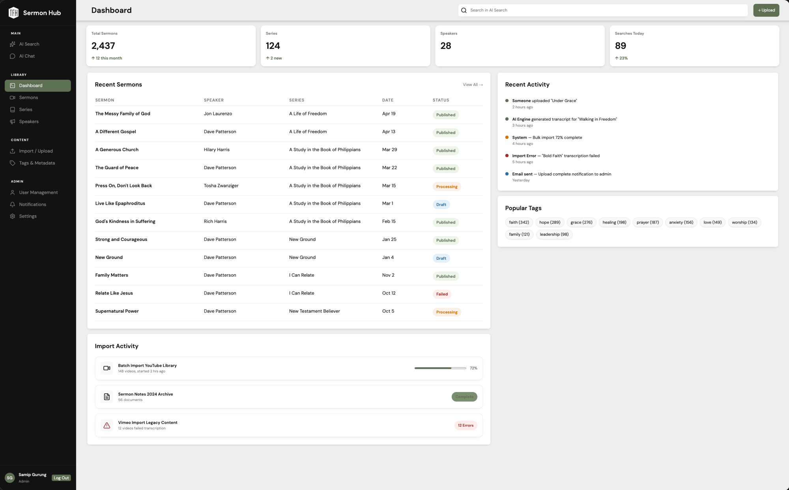
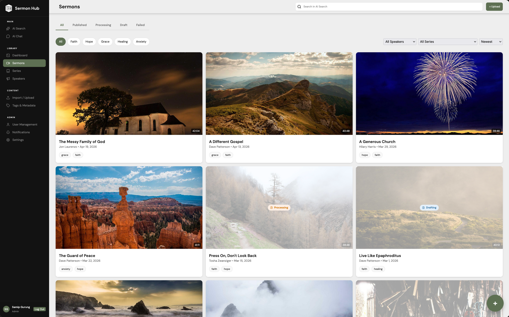
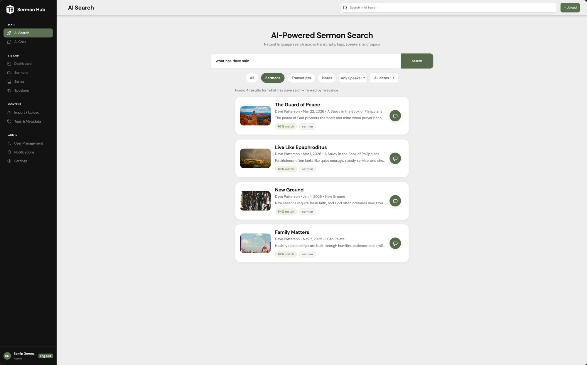
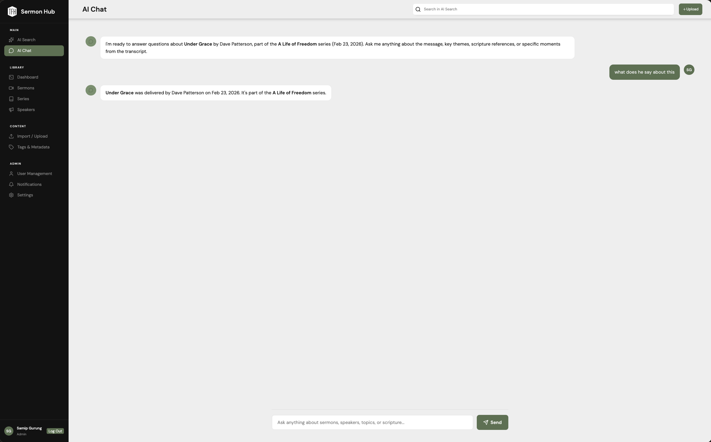
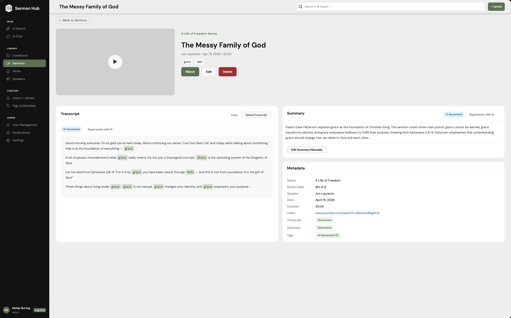
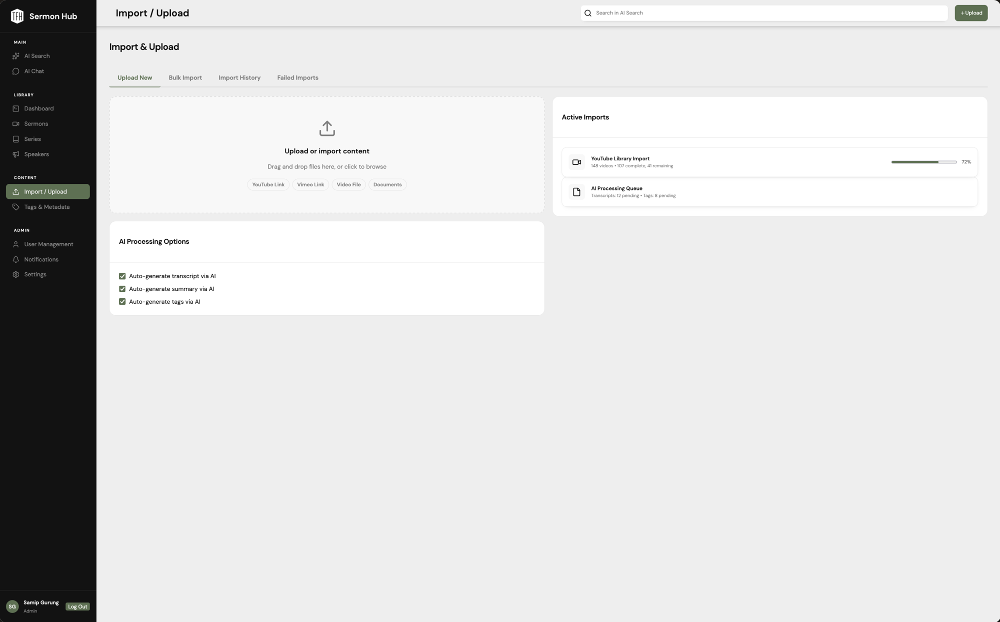

<div align="center">


# TFH Sermon Hub

**A centralized sermon management and AI-powered search platform for The Father's House**

[](https://react.dev/)
[](https://www.typescriptlang.org/)
[](https://flask.palletsprojects.com/)
[](https://www.python.org/)
[](https://vite.dev/)

</div>

---

## Overview

TFH Sermon Hub is an internal web application built for The Father's House church staff to organize, manage, and explore their sermon library. The platform provides a rich dashboard for tracking sermon content, a speaker and series management system, and AI-powered tools that allow staff to search across transcripts using natural language and have contextual conversations about specific sermons.

---

## Features

- **Dashboard** — At-a-glance stats for total sermons, series, speakers, and daily searches, alongside recent activity and import logs
- **Sermon Management** — Browse, filter, and view detailed information on every sermon including transcripts, summaries, tags, and video links
- **Series & Speaker Management** — Organize sermons by series and speaker with dedicated browsing views
- **AI-Powered Search** — Natural language search across sermon transcripts, tags, speakers, and topics ranked by relevance
- **AI Chat** — Conversational AI interface to ask questions about individual sermons or across the entire library
- **Import & Upload** — Drag-and-drop file import workflow with status tracking (Draft, Processing, Published, Failed)
- **Tags & Metadata** — View and manage AI-generated and manually added tags across all content
- **User Management** — Role-based access control for church staff
- **Notifications** — In-app notification system for import and processing updates

---

## Screenshots

> **Note to developer:** The following screenshots are needed. Please provide the files and they will be placed here.

### Dashboard


### Sermon Library


### AI Search


### AI Chat


### Sermon Detail


### Import / Upload


---

## Tech Stack

### Frontend
| Technology | Purpose |
|---|---|
| [React 19](https://react.dev/) | UI framework |
| [TypeScript 5.9](https://www.typescriptlang.org/) | Type safety |
| [Vite 8](https://vite.dev/) | Build tool & dev server |
| [React Router 7](https://reactrouter.com/) | Client-side routing |
| [TanStack Query 5](https://tanstack.com/query) | Server state & data fetching |
| [Zustand 5](https://zustand-demo.pmnd.rs/) | Client state management |
| [Axios](https://axios-http.com/) | HTTP client |
| [Biome](https://biomejs.dev/) | Linter & formatter |
| [Vitest](https://vitest.dev/) | Unit testing |
| [Playwright](https://playwright.dev/) | End-to-end testing |

### Backend
| Technology | Purpose |
|---|---|
| [Python 3.12+](https://www.python.org/) | Runtime |
| [Flask 3](https://flask.palletsprojects.com/) | Web framework |
| [Flask-SQLAlchemy](https://flask-sqlalchemy.readthedocs.io/) | ORM & database management |
| [Flask-JWT-Extended](https://flask-jwt-extended.readthedocs.io/) | JWT authentication |
| [Poetry](https://python-poetry.org/) | Dependency management |
| [Pytest](https://docs.pytest.org/) + [Syrupy](https://github.com/syrupy-project/syrupy) | Testing & snapshot testing |
| [Ruff](https://docs.astral.sh/ruff/) | Linter & formatter |

---

## Project Structure

```
TFH-SH-App/
├── Frontend/                   # React/TypeScript SPA
│   ├── src/
│   │   ├── components/         # Reusable UI components
│   │   ├── pages/              # Additional page-level components
│   │   ├── hooks/              # Custom React hooks
│   │   ├── lib/                # Utility and data-fetching functions
│   │   ├── types/              # TypeScript type definitions
│   │   ├── data/               # Static/mock data
│   │   ├── main.tsx            # App entry point & route definitions
│   │   └── index.css           # Global stylesheet
│   ├── public/                 # Static assets (favicon, etc.)
│   ├── e2e/                    # Playwright end-to-end tests
│   ├── tests/                  # Vitest unit tests
│   └── package.json
│
└── Backend/                    # Flask REST API
    ├── tsh/
    │   ├── app.py              # Flask app factory
    │   ├── auth.py             # JWT authentication & role enforcement
    │   ├── database.py         # SQLAlchemy database instance
    │   ├── models.py           # Data models (Sermon, Speaker, Series, Tag)
    │   └── views.py            # API route handlers
    ├── up.py                   # Database initialization script
    ├── populate.py             # Database seed script
    ├── run.sh / run.bat        # Dev server start scripts
    └── pyproject.toml
```

---

## Getting Started

### Prerequisites

- [Node.js](https://nodejs.org/) v20+
- [Python](https://www.python.org/) 3.12+
- [Poetry](https://python-poetry.org/docs/#installation)

---

### Backend Setup

```sh
# Navigate to the backend directory
cd Backend

# Install dependencies
poetry install

# Initialize the database
poetry run python up.py

# (Optional) Seed the database with sample data
poetry run python populate.py

# Start the dev server
./run.sh        # macOS/Linux
run.bat         # Windows
```

The backend will be available at `http://localhost:5000`.

---

### Frontend Setup

```sh
# Navigate to the frontend directory
cd Frontend

# Install dependencies
npm install

# Start the dev server
npm run dev
```

The frontend will be available at `http://localhost:5173`.

---

## API Endpoints

| Method | Endpoint | Description |
|---|---|---|
| `GET` | `/health` | Health check |
| `GET` | `/sermons` | List all sermons |
| `GET` | `/sermons/<id>` | Get a single sermon |
| `GET` | `/series` | List all series |
| `GET` | `/series/<id>` | Get a single series |
| `GET` | `/speakers` | List all speakers |
| `GET` | `/speakers/<id>` | Get a single speaker |
| `GET` | `/tags` | List all tags |
| `GET` | `/search?q=&type=&speaker=&date=` | AI-ranked search |

---

## Data Models

```
Sermon
├── title, video_link, duration, date, description
├── transcript (optional), summary (optional)
├── status: DRAFT | PROCESSING | PUBLISHED | FAILED
├── speaker → Speaker
├── series  → Series (optional)
└── tags    → [Tag]

Speaker
└── first_name, last_name

Series
└── title

Tag
├── name
└── source: AI | MANUAL
```

---

## Development Scripts

### Frontend

| Command | Description |
|---|---|
| `npm run dev` | Start development server |
| `npm run build` | Production build |
| `npm run lint` | Lint & auto-fix with Biome |
| `npm run test` | Run unit tests |
| `npm run e2e` | Run Playwright end-to-end tests |

### Backend

| Command | Description |
|---|---|
| `./run.sh` | Start Flask development server |
| `poetry run python up.py` | Initialize the database |
| `poetry run python populate.py` | Seed with sample data |
| `./test.sh` | Run backend tests |

---

## Team

Built as a senior capstone project (CSC 190) at Sacramento State University.

| Name |
|---|
| Samip Gurung |
| June Paulino |
| Jack Caycedo |
| Nicole Espinoza |
| Givin Yang |
| Griffin Johnson |
| Malakai Saechao |
| Louson Duong |

---

<div align="center">
  <sub>Sacramento State University — CSC 190 Senior Project, Spring 2026</sub>
</div>
