<div align="center">

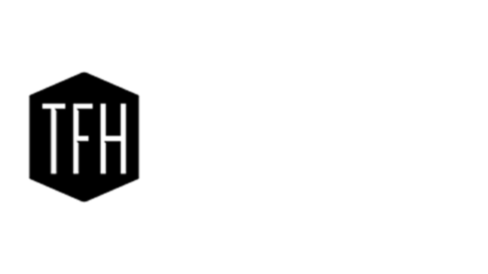

**A centralized sermon management and AI-powered search platform for The Father's House**

[](https://react.dev/)
[](https://www.typescriptlang.org/)
[](https://flask.palletsprojects.com/)
[](https://www.python.org/)
[](https://vite.dev/)

</div>

---

## Overview

TFH Sermon Hub is an internal web application built for The Father's House church staff to organize, manage, and explore their sermon library. The platform provides a rich dashboard for tracking sermon content, a speaker and series management system, and AI-powered tools that allow staff to search across transcripts using natural language and have contextual conversations about specific sermons.

---

## Features

- **Dashboard** : At-a-glance stats for total sermons, series, speakers, and daily searches, alongside recent activity and import logs
- **Sermon Management** : Browse, filter, and view detailed information on every sermon including transcripts, summaries, tags, and video links
- **Series & Speaker Management** : Organize sermons by series and speaker with dedicated browsing views
- **AI-Powered Search** : Natural language search across sermon transcripts, tags, speakers, and topics ranked by relevance
- **AI Chat** : Conversational AI interface to ask questions about individual sermons or across the entire library
- **Import & Upload** : Drag-and-drop file import workflow with status tracking (Draft, Processing, Published, Failed)
- **Tags & Metadata** : View and manage AI-generated and manually added tags across all content
- **User Management** : Role-based access control for church staff
- **Notifications** : In-app notification system for import and processing updates

---

## Demo Images

The following screenshots show the current frontend pages for TFH Sermon Hub.

### Dashboard
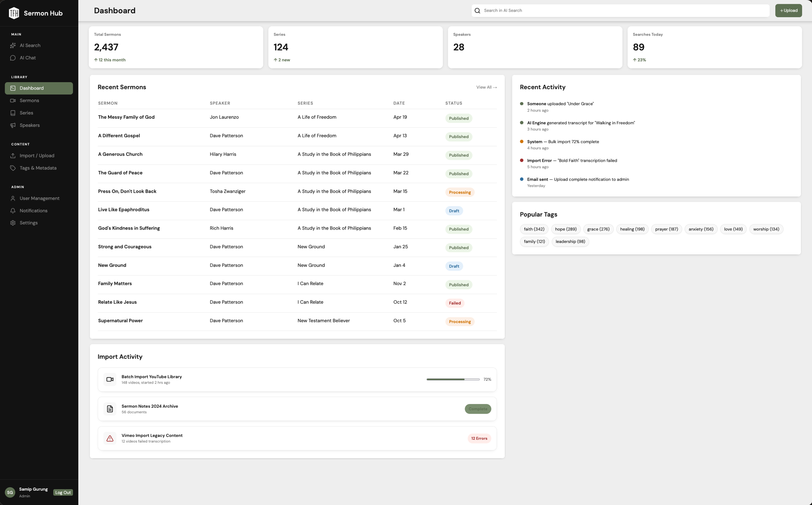

### Sermon Library
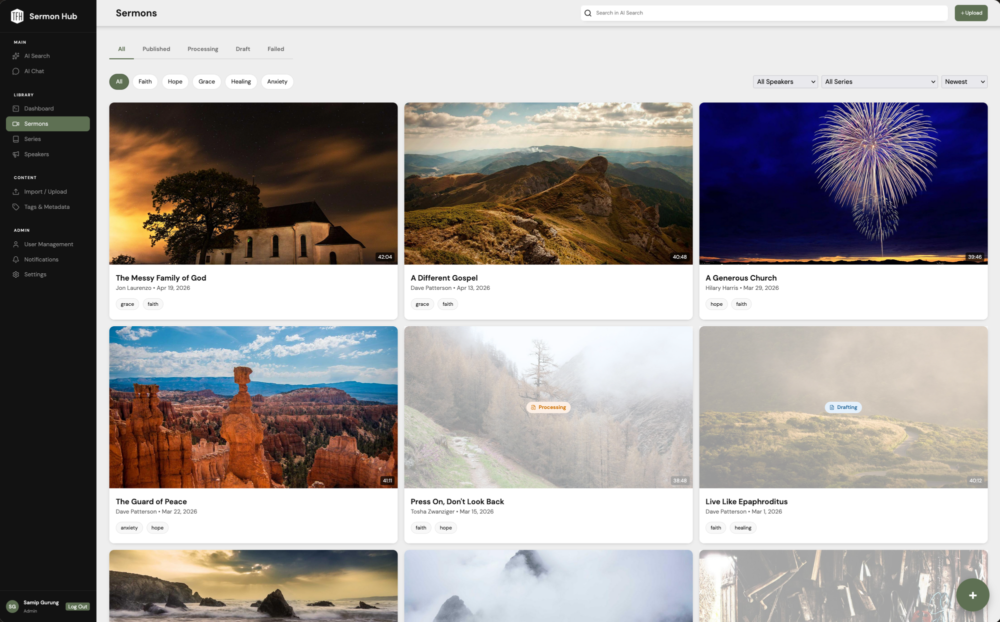

### AI Search
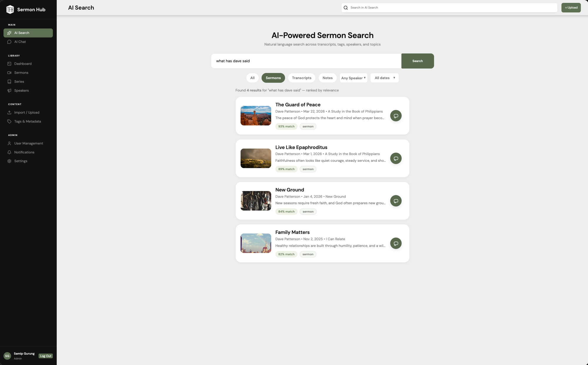

### AI Chat
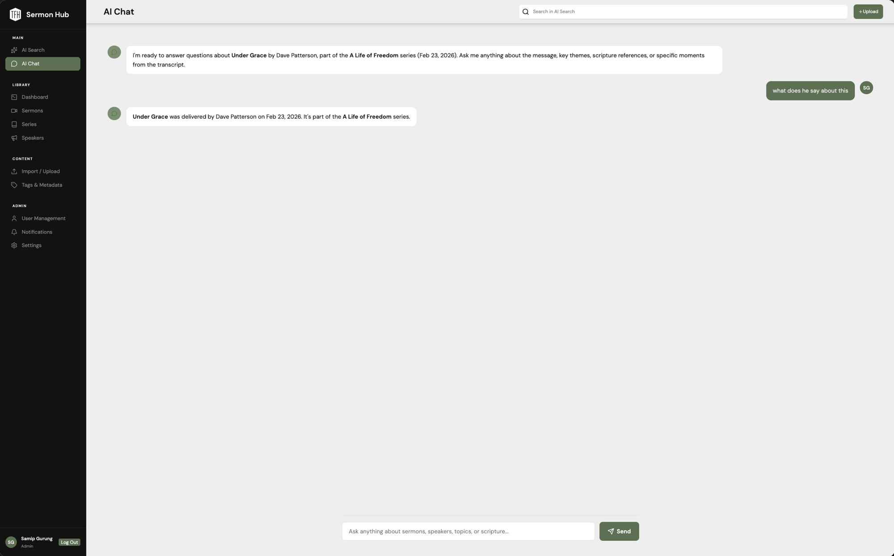

### Sermon Detail
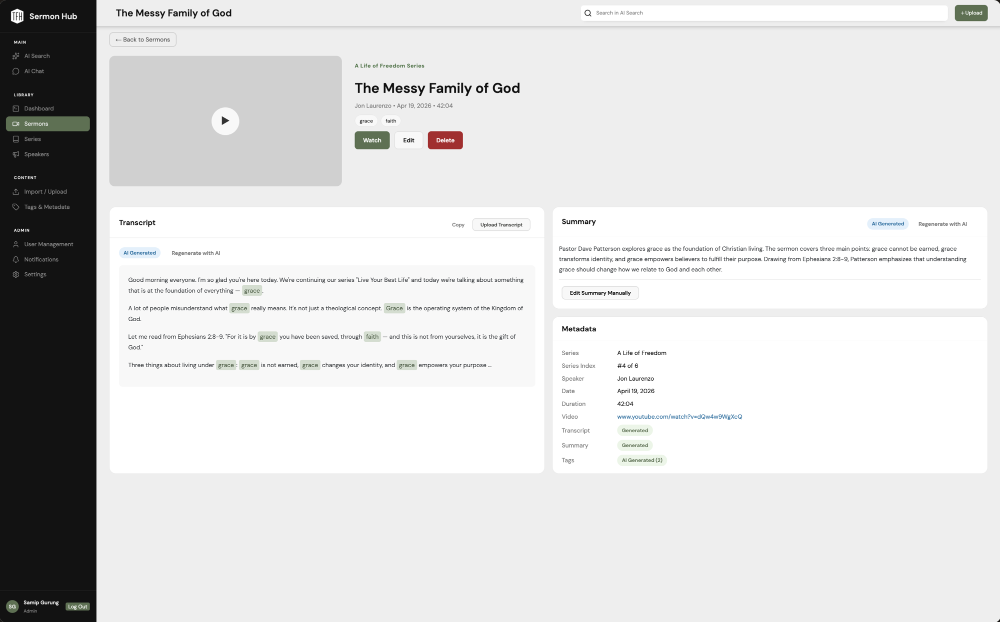

### Import / Upload
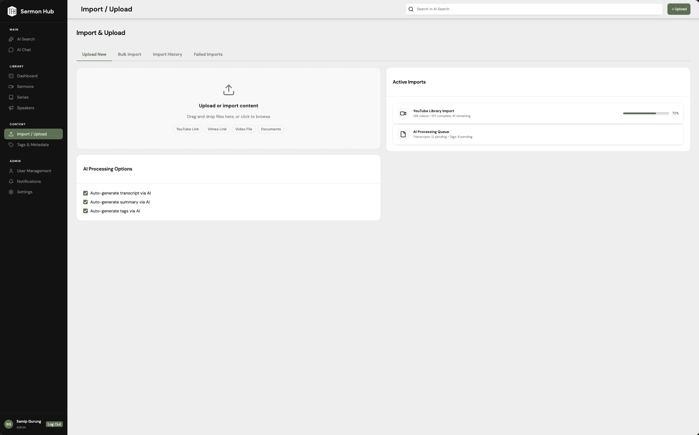

### Series
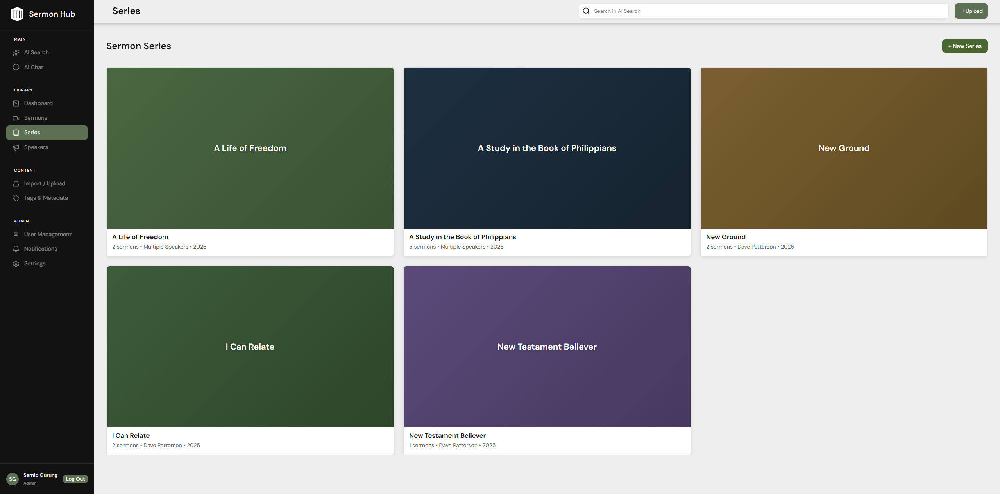

### Speakers
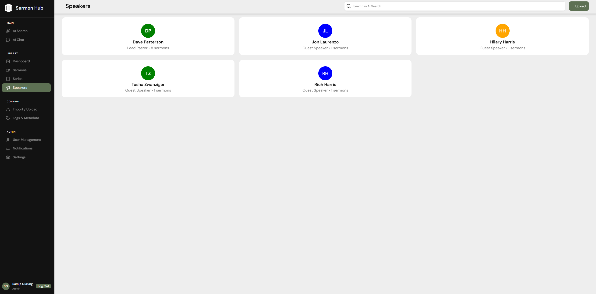

### Tags & Metadata
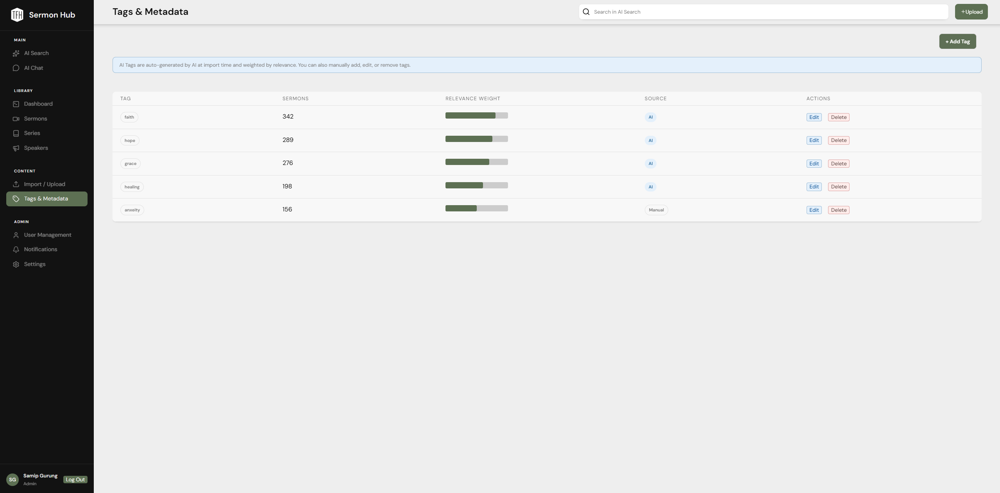

---

## System Architecture

The following diagram shows the planned application architecture for TFH Sermon Hub, including the client, frontend, backend, database, cache, authentication provider, and AI provider.

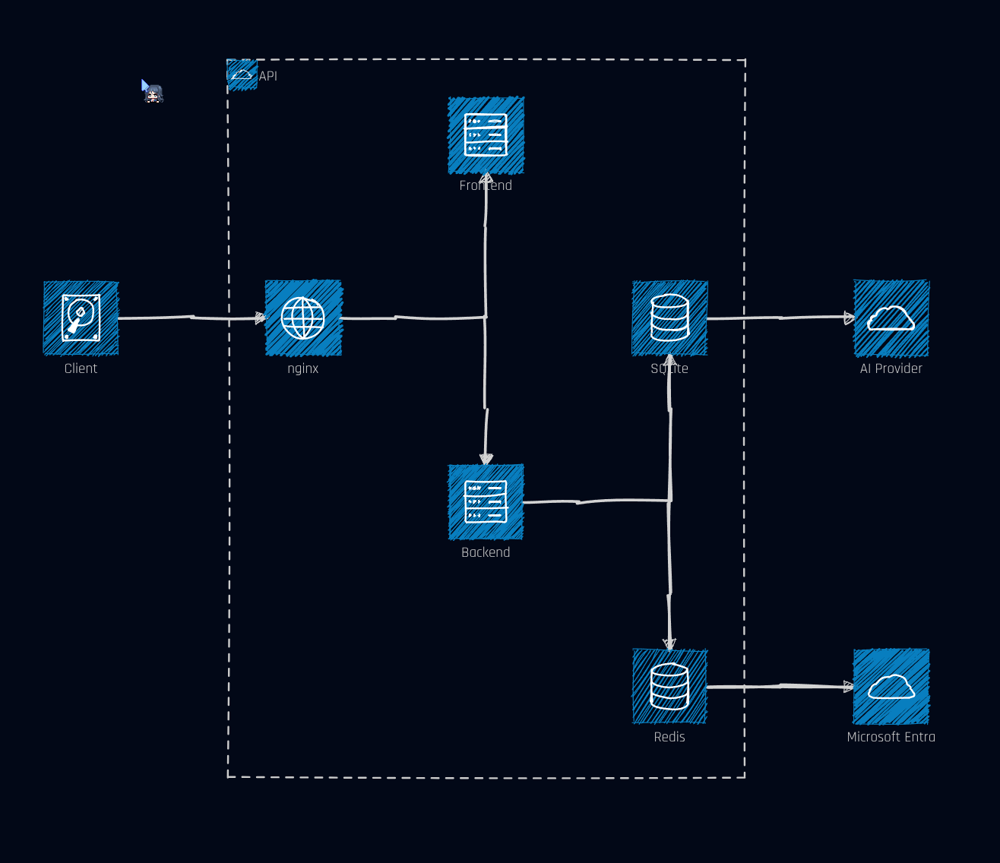

---

## Database Design

The following Entity Relationship Diagram shows the planned database structure for sermons, speakers, series, and tags.

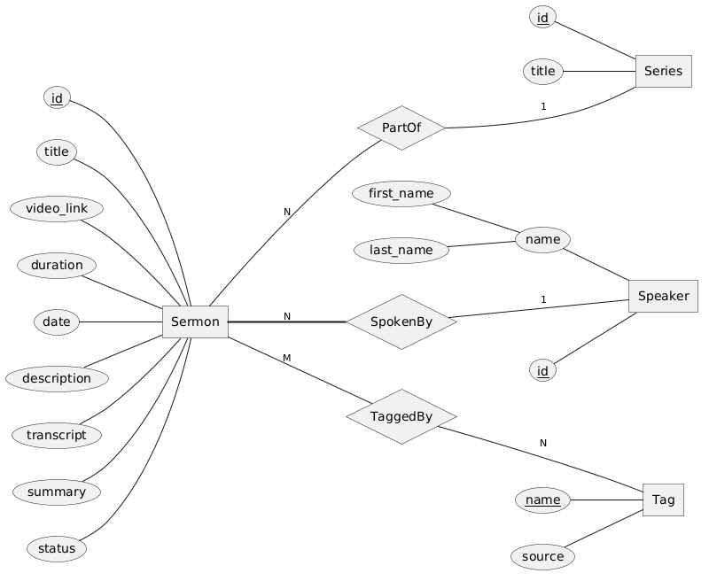

---

## Tech Stack

### Frontend
| Technology | Purpose |
|---|---|
| [React 19](https://react.dev/) | UI framework |
| [TypeScript 5.9](https://www.typescriptlang.org/) | Type safety |
| [Vite 8](https://vite.dev/) | Build tool & dev server |
| [React Router 7](https://reactrouter.com/) | Client-side routing |
| [TanStack Query 5](https://tanstack.com/query) | Server state & data fetching |
| [Zustand 5](https://zustand-demo.pmnd.rs/) | Client state management |
| [Axios](https://axios-http.com/) | HTTP client |
| [Biome](https://biomejs.dev/) | Linter & formatter |
| [Vitest](https://vitest.dev/) | Unit testing |
| [Playwright](https://playwright.dev/) | End-to-end testing |

### Backend
| Technology | Purpose |
|---|---|
| [Python 3.12+](https://www.python.org/) | Runtime |
| [Flask 3](https://flask.palletsprojects.com/) | Web framework |
| [Flask-SQLAlchemy](https://flask-sqlalchemy.readthedocs.io/) | ORM & database management |
| [Flask-Migrate](https://flask-migrate.readthedocs.io/) | Database migrations (Alembic) |
| [Flask-JWT-Extended](https://flask-jwt-extended.readthedocs.io/) | JWT authentication |
| [Poetry](https://python-poetry.org/) | Dependency management |
| [Pytest](https://docs.pytest.org/) + [Syrupy](https://github.com/syrupy-project/syrupy) | Testing & snapshot testing |
| [Ruff](https://docs.astral.sh/ruff/) | Linter & formatter |

---

## Project Structure

```
TFH-SH-App/
├── Frontend/                   # React/TypeScript SPA
│   ├── src/
│   │   ├── components/         # Reusable UI components
│   │   ├── pages/              # Additional page-level components
│   │   ├── hooks/              # Custom React hooks
│   │   ├── lib/                # Utility and data-fetching functions
│   │   ├── types/              # TypeScript type definitions
│   │   ├── data/               # Static/mock data
│   │   ├── main.tsx            # App entry point & route definitions
│   │   └── index.css           # Global stylesheet
│   ├── public/                 # Static assets (favicon, etc.)
│   ├── e2e/                    # Playwright end-to-end tests
│   ├── tests/                  # Vitest unit tests
│   └── package.json
│
└── Backend/                    # Flask REST API
    ├── tsh/
    │   ├── app.py              # Flask app factory
    │   ├── auth.py             # JWT authentication & role enforcement
    │   ├── database.py         # SQLAlchemy database instance
    │   ├── models.py           # Data models (Sermon, Speaker, Series, Tag)
    │   └── views.py            # API route handlers
    ├── up.py                   # Runs database migrations
    ├── populate.py             # Database seed script
    ├── run.sh / run.bat        # Dev server start scripts
    └── pyproject.toml
```

---

## Getting Started

### Prerequisites

- [Node.js](https://nodejs.org/) v20+
- [Python](https://www.python.org/) 3.12+
- [Poetry](https://python-poetry.org/docs/#installation)

---

### Backend Setup

```sh
# Navigate to the backend directory
cd Backend

# For first-time setup, copy the examples (keep existing local config files)
cp .env.example .env
cp tsh/testing.cfg.example tsh/testing.cfg

# Install dependencies
poetry install

# Create or update the database to the latest schema
poetry run python up.py

# (Optional) Seed the database with sample data
poetry run python populate.py

# Start the dev server
./run.sh        # macOS/Linux
run.bat         # Windows
```

The backend will be available at `http://localhost:5000`.

In Windows Command Prompt, use `copy` instead of `cp`. Update the local config
values as needed, including the placeholder `JWT_SECRET_KEY` in `tsh/testing.cfg`.

#### Changing the database

The schema is managed with migrations, not `db.create_all()`. After pulling, run `poetry run python up.py` to apply any new ones. A database made before migrations is detected and upgraded automatically.

Keep your existing database; deleting `instance/testing.db` is unnecessary.
Back it up before the first upgrade. Use `up.py` for that first upgrade so the
existing schema is recorded at the baseline before applying later migrations.
Running `flask db upgrade` directly on an unversioned database tries to recreate
its existing tables.

To change a model:

```sh
# 1. Edit tsh/models.py
# 2. Generate a migration and read it over before committing
poetry run flask --app "tsh:create_app('testing.cfg')" db migrate -m "short description"
# 3. Apply it
poetry run python up.py
```

Commit the new file in `migrations/versions/` with your model change. New non-nullable columns need a default, or the migration will fail on databases that already have rows.

#### Background jobs

Sermon processing runs as a background job. Where it runs depends on `REDIS_URL`:

- **`REDIS_URL` unset (the default):** jobs run inline in the Flask process. No Redis is needed, so this works on plain Windows too. Tests always run this way.
- **`REDIS_URL` set:** jobs go to the `sermons` queue in Redis and a separate worker runs them.

To use Redis locally (WSL, macOS or Linux):

```sh
# Install and start Redis (or: docker run -p 6379:6379 redis)
sudo apt install redis-server
redis-server

# Then in Backend/.env
REDIS_URL=redis://localhost:6379/0

# Start the worker in its own terminal, next to ./run.sh
./worker.sh
```

The worker runs each job inside the Flask app context, so jobs can use the database. Without `REDIS_URL` it exits with a message, since there is nothing for it to do. With devenv, `devenv up` starts Redis and the worker for you.

To watch a sermon sit in `Processing` before the real steps exist, set `PIPELINE_DUMMY_DELAY` (seconds) in `tsh/testing.cfg`. Without Redis the delay blocks the request, so keep it small or use the worker.

#### Importing from YouTube

Sermons are imported from the TFH YouTube channel: each playlist becomes a series and each video a sermon. The import reads public data only, so it needs an API key, not a Google sign-in.

To get a key:

1. In the [Google Cloud Console](https://console.cloud.google.com/), create a project (or pick an existing one).
2. Under **APIs & Services → Library**, enable **YouTube Data API v3**.
3. Under **APIs & Services → Credentials**, create an **API key**. Restrict it to the YouTube Data API v3.
4. Put it in `Backend/.env` as `YOUTUBE_API_KEY=...`. Never commit it or paste it into an issue or PR.

The other settings default to the TFH channel, so only the key is required. Override any of them in `Backend/.env`:

| Setting | Default | What it does |
|---|---|---|
| `YOUTUBE_CHANNEL_ID` | `UCua-IeYiJ1LiNQ6ydGZbIaw` | The channel to import from. |
| `YOUTUBE_MASTER_PLAYLIST` | `TFH Latest Messages` | Playlist whose videos are imported but that never becomes a series. |
| `YOUTUBE_IGNORE_PLAYLISTS` | `Worship Focus`, `TFH Worship Moments`, `Worship Resources To Help You Change The Atmosphere - After God's Heart - Pt2`, `Church Online` | Comma-separated playlists that are skipped entirely (worship songs and full services). |
| `YOUTUBE_SERIES_ALIASES` | `Book of James=The Book of James` | Comma-separated `Playlist name=Series name` pairs, for playlists that should merge into one series but differ by more than case. |
| `YOUTUBE_MAX_MINUTES` | `60` | Videos longer than this are skipped and listed in the import report. Sermons run up to about 45 minutes and full services about 90. |

Playlists can be named by title or by playlist ID. Playlists whose titles differ only by case merge into one series.

---

### Frontend Setup

```sh
# Navigate to the frontend directory
cd Frontend

# Install dependencies
npm install

# Start the dev server
npm run dev
```

The frontend will be available at `http://localhost:5173`.

---

## API Endpoints

| Method | Endpoint | Description |
|---|---|---|
| `GET` | `/health` | Health check |
| `GET` | `/sermons` | List all sermons |
| `GET` | `/sermons/<id>` | Get a single sermon |
| `POST` | `/sermons/<id>/reprocess` | Re-run sermon processing (Admin only, 202; 503 if Redis is down) |
| `GET` | `/series` | List all series |
| `GET` | `/series/<id>` | Get a single series |
| `GET` | `/speakers` | List all speakers |
| `GET` | `/speakers/<id>` | Get a single speaker |
| `GET` | `/tags` | List all tags |
| `GET` | `/search?q=&type=&speaker=&date=` | AI-ranked search |

---

## Timeline & Roadmap

| Sprint / Phase | Dates | Completed / Planned Work | Status |
|---|---|---|---|
| Sprint 0 | Jan. 26, 2026 – Feb. 22, 2026 | Formed the team, selected the project, identified the client, created the project proposal, began project planning, and started gathering requirements from the product owner. | Completed |
| Sprint 1 | Feb. 23, 2026 – Mar. 8, 2026 | Created the project charter, mockup prototype, initial ERD, cost estimate research, Jira project structure, GitHub repository, and early project planning documents. | Completed |
| Sprint 2 | Mar. 19, 2026 – Mar. 23, 2026 | Built the initial frontend foundation, including the admin dashboard, vertical left navigation, Sermons page, AI-powered sermon search, AI search results, Tags & Metadata page, Import & Upload interface, and Microsoft Entra role assignment support. | Completed |
| Sprint 3 | Mar. 30, 2026 – Apr. 12, 2026 | Continued frontend development and completed additional staff-facing pages, including Series, Speakers, Tags & Metadata, User Management, Notifications, and Settings. The goal was to complete the remaining frontend pages and ensure frontend functionality worked across the application. | Completed |
| Sprint 4 | Apr. 13, 2026 – Apr. 27, 2026 | Added final CSC 190 frontend improvements, including a basic mobile website framework, AI Chat page, login page, top-right search bar and upload button, expanded AI Search UI, upload button from the Sermons page, and sermon detail popup behavior. The repository will be left in a stable baseline state before summer break. | Completed |
| Summer Break Pause | Summer 2026 | Project development will pause during summer break. The team will not actively work on the project during this period. The client will be informed that development will resume in CSC 191. | Planned |
| Sprint 5 | CSC 191 | Resume development, review the existing codebase, confirm the project baseline, refresh Jira planning, and begin connecting frontend pages to backend API functionality. | Planned |
| Sprint 6 | CSC 191 | Expand backend integration for sermons, speakers, series, tags, user management, notifications, and settings. Continue role-based access control and authentication work. | Planned |
| Sprint 7 | CSC 191 | Implement and refine AI-powered search, AI chat, transcript search, sermon metadata handling, and import/upload processing with live or production-like data. | Planned |
| Sprint 8 | CSC 191 | Begin formal testing, including frontend tests, backend tests, integration testing, user flow testing, and bug fixes. Prepare deployment documentation and client-facing usage instructions. | Planned |
| Sprint 9 | CSC 191 | Finalize testing, deployment, user guide, maintenance manual, developer documentation, and production handoff to the client. Prepare the final project presentation and Senior Project Showcase materials. | Planned |

---

## Data Models

```
Sermon
├── title, video_link, duration, date, description
├── transcript (optional), summary (optional)
├── status: DRAFT | PROCESSING | PUBLISHED | FAILED
├── speaker → Speaker
├── series  → Series (optional)
└── tags    → [Tag]

Speaker
└── first_name, last_name

Series
└── title

Tag
├── name
└── source: AI | MANUAL
```

---

## Development Scripts

### Frontend

| Command | Description |
|---|---|
| `npm run dev` | Start development server |
| `npm run build` | Production build |
| `npm run lint` | Lint & auto-fix with Biome |
| `npm run test` | Run unit tests |
| `npm run e2e` | Run Playwright end-to-end tests |

### Backend

| Command | Description |
|---|---|
| `./run.sh` | Start Flask development server |
| `./worker.sh` | Start the background job worker (needs `REDIS_URL`) |
| `poetry run python up.py` | Create or update the database (runs migrations) |
| `poetry run flask --app "tsh:create_app('testing.cfg')" db migrate -m "..."` | Generate a migration after changing models |
| `poetry run python populate.py` | Seed with sample data |
| `./test.sh` | Run backend tests |

---

## Testing

Testing instructions will be expanded next semester.

Current planned testing tools include Vitest and Playwright for the frontend, and Pytest for the backend.

---

## Deployment

Deployment instructions will be added next semester.

---

## Developer Instructions

Initial local development instructions are included in the Getting Started and Development Scripts sections above. More complete developer documentation will be added next semester.

---

## Client

This project is being developed for The Father's House.

---

## License

License information will be added if applicable.

---

## Team

Built as a senior capstone project (CSC 190) at Sacramento State University.

| Name |
|---|
| Samip Gurung |
| June Paulino |
| Jack Caycedo |
| Nicole Espinoza |
| Givin Yang |
| Griffin Johnson |
| Malakai Saechao |
| Louson Duong |

---

<div align="center">
  <sub>Sacramento State University — CSC 190 Senior Project, Spring 2026</sub>
</div>
